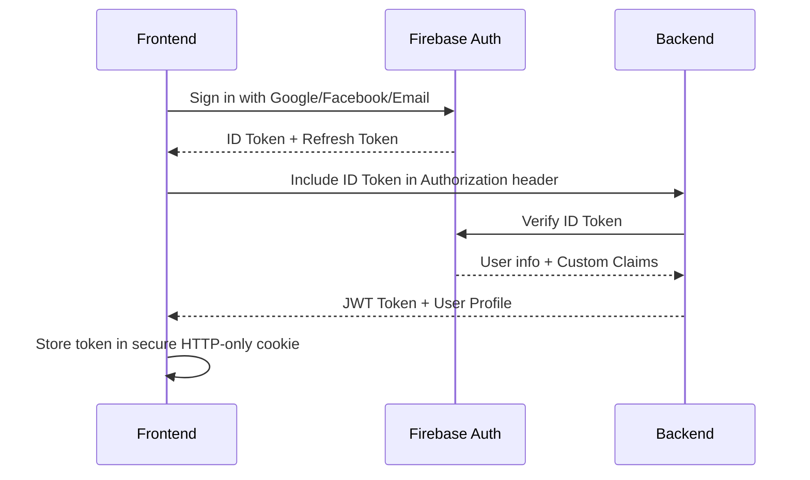

# API Flow Analysis

This document provides a detailed analysis of the API endpoints, request/response flows, and data models used in the TRAVAIA platform.

## Table of Contents
1. [Authentication Flow](#1-authentication-flow)
2. [Chatbot API](#2-chatbot-api)
3. [User Management](#3-user-management)
4. [Data Models](#4-data-models)
5. [Error Handling](#5-error-handling)
6. [Rate Limiting](#6-rate-limiting)
7. [WebSocket/SSE Endpoints](#7-websocketsse-endpoints)

## 1. Authentication Flow

### 1.1 Firebase Authentication



### 1.2 Token Refresh

```typescript
// Frontend token refresh logic
const refreshToken = async () => {
  try {
    const user = auth.currentUser;
    if (!user) throw new Error('No authenticated user');
    
    // Force token refresh
    await user.getIdToken(true);
    const newToken = await user.getIdToken();
    
    // Update API client with new token
    apiClient.defaults.headers.common['Authorization'] = `Bearer ${newToken}`;
    return newToken;
  } catch (error) {
    // Handle refresh failure (e.g., sign out user)
    await auth.signOut();
    throw error;
  }
};
```

## 2. Chatbot API

### 2.1 Session Management

#### Create Chat Session
```http
POST /api/apps/chatbot/users/{userId}/sessions
Authorization: Bearer {firebaseToken}
Content-Type: application/json

{
  "context": {
    "role": "job_seeker",
    "preferences": {
      "industry": "technology",
      "experience_level": "mid"
    }
  }
}
```

**Response**
```json
{
  "sessionId": "sess_abc123",
  "createdAt": "2025-09-04T12:00:00Z",
  "context": {}
}
```

### 2.2 Message Exchange

#### Send Message
```http
POST /api/apps/chatbot/sessions/{sessionId}/messages
Authorization: Bearer {firebaseToken}
Content-Type: application/json

{
  "content": "What are the latest trends in AI?",
  "metadata": {
    "source": "web_chat",
    "device_id": "desktop-123"
  }
}
```

**Streaming Response (SSE)**
```
event: message
data: {"content": "Let me share", "type": "chunk"}

event: message
data: {"content": " the latest", "type": "chunk"}

event: done
data: {"messageId": "msg_123", "tokensUsed": 42}
```

## 3. User Management

### 3.1 Get User Profile
```http
GET /api/users/me
Authorization: Bearer {firebaseToken}
```

**Response**
```json
{
  "id": "user_123",
  "email": "user@example.com",
  "name": "John Doe",
  "preferences": {
    "notifications": true,
    "theme": "dark"
  },
  "createdAt": "2025-01-01T00:00:00Z",
  "lastLogin": "2025-09-04T10:30:00Z"
}
```

## 4. Data Models

### 4.1 Chat Message
```typescript
interface ChatMessage {
  id: string;
  sessionId: string;
  role: 'user' | 'assistant' | 'system';
  content: string;
  metadata: {
    tokens: number;
    model?: string;
    timestamp: string;
  };
  createdAt: string;
  updatedAt: string;
}
```

### 4.2 User Session
```typescript
interface UserSession {
  id: string;
  userId: string;
  context: Record<string, any>;
  createdAt: string;
  updatedAt: string;
  expiresAt?: string;
  metadata: {
    userAgent: string;
    ipAddress: string;
    location?: {
      city?: string;
      country?: string;
    };
  };
}
```

## 5. Error Handling

### 5.1 Standard Error Response
```json
{
  "error": {
    "code": "invalid_request",
    "message": "Invalid or missing required fields",
    "details": [
      {
        "field": "email",
        "message": "Must be a valid email address"
      }
    ],
    "requestId": "req_123456"
  }
}
```

### 5.2 Common Error Codes
| Status | Code | Description |
|--------|------|-------------|
| 400 | invalid_request | Malformed request |
| 401 | unauthorized | Missing or invalid auth token |
| 403 | forbidden | Insufficient permissions |
| 404 | not_found | Resource not found |
| 429 | rate_limit_exceeded | Too many requests |
| 500 | internal_error | Server error |

## 6. Rate Limiting

- **Anonymous**: 100 requests/hour
- **Authenticated**: 1,000 requests/hour
- **API Key**: 10,000 requests/hour

**Headers**
```
X-RateLimit-Limit: 1000
X-RateLimit-Remaining: 850
X-RateLimit-Reset: 3600
```

## 7. WebSocket/SSE Endpoints

### 7.1 Real-time Chat
```
wss://api.travaia.ai/ws/chat/{sessionId}
```

**Message Format**
```typescript
interface ChatMessage {
  type: 'user_message' | 'ai_response' | 'typing' | 'error';
  content: string;
  timestamp: string;
  metadata?: Record<string, any>;
}
```

### 7.2 Connection Lifecycle
1. Client connects with valid JWT
2. Server authenticates and accepts connection
3. Messages are exchanged bidirectionally
4. Client/Server sends ping/pong to keep connection alive
5. On error or timeout, connection is closed with status code

## 8. Security Considerations

### 8.1 Data Protection
- All data encrypted in transit (TLS 1.3+)
- Sensitive fields encrypted at rest
- Regular security audits and penetration testing

### 8.2 Rate Limiting
- Implemented at API Gateway level
- IP-based and user-based rate limiting
- Circuit breakers for abusive patterns

### 8.3 Monitoring
- Real-time monitoring of API usage
- Anomaly detection for suspicious activities
- Comprehensive audit logging
