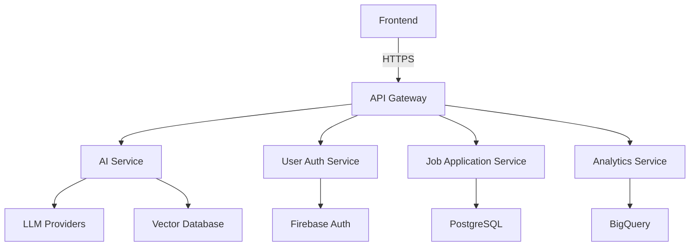

# TRAVAIA - AI-Powered Career Platform

**TRAVAIA** is a comprehensive career development platform that combines AI-powered coaching, job application tracking, and skill development. Built with React, FastAPI microservices, and Google Cloud infrastructure, TRAVAIA helps job seekers navigate their career journey with personalized AI assistance.

## 🚀 Key Features

- **AI Career Coach**: Get personalized career guidance and interview preparation
- **Job Application Tracker**: Manage job applications and track progress
- **Skill Development**: Identify and develop in-demand skills
- **Interview Practice**: Practice with AI-powered mock interviews
- **Analytics Dashboard**: Track your job search metrics and progress

## 🏗️ Architecture Overview

TRAVAIA follows a modern microservices architecture with centralized AI orchestration:



### Core Services

- **AI Service**: Centralized AI orchestration using Google's Agent Development Kit (ADK)
- **User Auth Service**: Authentication, user profiles, and access control
- **Job Application Service**: Manage job applications, interviews, and follow-ups
- **Analytics Service**: Track and visualize job search metrics

## 🔧 Getting Started

### Prerequisites

- Node.js 18+
- Python 3.10+
- Google Cloud SDK
- Docker and Docker Compose
- Firebase CLI

### Local Development

1. **Clone the repository**
   ```bash
   git clone https://github.com/your-org/travaia-ai.git
   cd travaia-ai
   ```

2. **Set up environment variables**
   ```bash
   cp .env.example .env
   # Update the .env file with your configuration
   ```

3. **Start the development environment**
   ```bash
   # Start backend services
   docker-compose up -d
   
   # Install frontend dependencies
   cd frontend
   npm install
   
   # Start the development server
   npm run dev
   ```

4. **Access the application**
   - Frontend: http://localhost:3000
   - API Documentation: http://localhost:8000/docs

## 🤖 AI Chatbot Integration

The platform features an AI-powered chatbot that assists users with:
- Career advice and guidance
- Interview preparation
- Resume review and optimization
- Job search strategies

### Chatbot Data Flow

1. **User Authentication**
   - Frontend authenticates with Firebase Auth
   - JWT token is obtained and included in API requests

2. **Session Initialization**
   ```typescript
   // Example: Initializing a chat session
   const sessionId = await chatbotService.initializeSession(
     userId, 
     authToken
   );
   ```

3. **Message Exchange**
   ```typescript
   // Example: Sending a message
   await chatbotService.sendMessage(
     messageText,
     userId,
     (messageId, content) => {
       // Handle streaming updates
     },
     () => {
       // Handle completion
     },
     (error) => {
       // Handle errors
     },
     authToken,
     sessionId
   );
   ```

4. **Response Processing**
   - AI Service processes the message using the configured LLM
   - Response is streamed back to the frontend in real-time
   - Frontend updates the chat interface with the response

## 🌐 API Documentation

API documentation is available at `/docs` when running the backend service. The API follows the OpenAPI 3.0 specification.

## 🛠️ Development

### Project Structure

```
travaia-ai/
├── backend/                  # Backend services
│   ├── ai-service/           # AI orchestration and processing
│   ├── api-gateway/          # API Gateway and routing
│   ├── user-auth-service/    # Authentication and user management
│   └── ...                   # Other microservices
├── frontend/                 # React frontend application
├── demoUI/                   # Demo implementation
├── .github/                  # GitHub workflows
└── docs/                     # Documentation
```

### Testing

```bash
# Run unit tests
npm test

# Run integration tests
npm run test:integration

# Run end-to-end tests
npm run test:e2e
```

## 📄 License

This project is licensed under the Apache License 2.0 - see the [LICENSE](LICENSE) file for details.

## 🤝 Contributing

Contributions are welcome! Please read our [contributing guidelines](CONTRIBUTING.md) to get started.

## 📧 Contact

For questions or support, please contact [support@travaia.ai](mailto:support@travaia.ai)

<table>
  <thead>
    <tr>
      <th colspan="2">Key Features</th>
    </tr>
  </thead>
  <tbody>
    <tr>
      <td>🎯</td>
      <td><strong>Job Application Management:</strong> Complete CRUD operations for job applications with status tracking, notes, and contact management.</td>
    </tr>
    <tr>
      <td>🤖</td>
      <td><strong>AI-Powered Insights:</strong> Centralized AI service using Google's Agent Development Kit (ADK) for job analysis and recommendations.</td>
    </tr>
    <tr>
      <td>🔐</td>
      <td><strong>Secure Authentication:</strong> Firebase-based user authentication with JWT token validation across all microservices.</td>
    </tr>
    <tr>
      <td>☁️</td>
      <td><strong>Cloud-Native Architecture:</strong> Microservices deployed on Google Cloud Run with API Gateway routing and Pub/Sub messaging.</td>
    </tr>
    <tr>
      <td>📊</td>
      <td><strong>Analytics & Gamification:</strong> User progress tracking, achievements, and comprehensive application analytics.</td>
    </tr>
  </tbody>
</table>

## 🏗️ Architecture Overview

TRAVAIA follows a modern microservices architecture with clear separation of concerns:

```
┌─────────────────┐    ┌──────────────────┐    ┌─────────────────────┐
│   Frontend      │    │   API Gateway    │    │   Microservices     │
│                 │    │                  │    │                     │
│ • React/Vite    │───▶│ • Google Cloud   │───▶│ • ai-service        │
│ • Firebase Auth │    │   API Gateway    │    │ • application-job   │
│ • Tailwind CSS  │    │ • JWT Validation │    │ • user-auth         │
│                 │    │ • Rate Limiting  │    │ • analytics-growth  │
└─────────────────┘    └──────────────────┘    └─────────────────────┘
```

### Core Services

- **AI Service**: Centralized AI orchestration using Google ADK for job analysis and recommendations
- **Application Job Service**: CRUD operations for job applications, notes, contacts, and favorites
- **User Auth Service**: Authentication, user profiles, gamification, and progress tracking
- **Analytics Growth Service**: User analytics, growth metrics, and reporting

## 🚀 Getting Started
**Prerequisites:** **[Python 3.10+](https://www.python.org/downloads/)**, **[Node.js](https://nodejs.org/)**, **[uv](https://github.com/astral-sh/uv)**

You have two options to get started. Choose the one that best fits your setup:

*   A. **[Google AI Studio](#a-google-ai-studio)**: Choose this path if you want to use a **Google AI Studio API key**. This method involves cloning the sample repository.
*   B. **[Google Cloud Vertex AI](#b-google-cloud-vertex-ai)**: Choose this path if you want to use an existing **Google Cloud project** for authentication. This method generates a new, prod-ready project using the [agent-starter-pack](https://goo.gle/agent-starter-pack) including all the deployment scripts required.

---

### A. Google AI Studio

You'll need a **[Google AI Studio API Key](https://aistudio.google.com/app/apikey)**.

#### Step 1: Clone Repository
Clone the repository and `cd` into the project directory.

```bash
git clone https://github.com/google/adk-samples.git
cd adk-samples/python/agents/gemini-fullstack
```

#### Step 2: Set Environment Variables
Create a `.env` file in the `app` folder by running the following command (replace YOUR_AI_STUDIO_API_KEY with your actual API key):

```bash
echo "GOOGLE_GENAI_USE_VERTEXAI=FALSE" >> app/.env
echo "GOOGLE_API_KEY=YOUR_AI_STUDIO_API_KEY" >> app/.env
```

#### Step 3: Install & Run
From the `gemini-fullstack` directory, install dependencies and start the servers.

```bash
make install && make dev
```
Your agent is now running at `http://localhost:5173`.

---

### B. Google Cloud Vertex AI

You'll also need: **[Google Cloud SDK](https://cloud.google.com/sdk/docs/install)** and a **Google Cloud Project** with the **Vertex AI API** enabled.

#### Step 1: Create Project from Template
This command uses the [Agent Starter Pack](https://goo.gle/agent-starter-pack) to create a new directory (`my-fullstack-agent`) with all the necessary code.
```bash
# Create and activate a virtual environment
python -m venv .venv && source .venv/bin/activate # On Windows: .venv\Scripts\activate

# Install the starter pack and create your project
pip install --upgrade agent-starter-pack
agent-starter-pack create my-fullstack-agent -a adk@gemini-fullstack
```
<details>
<summary>⚡️ Alternative: Using uv</summary>

If you have [`uv`](https://github.com/astral-sh/uv) installed, you can create and set up your project with a single command:
```bash
uvx agent-starter-pack create my-fullstack-agent -a adk@gemini-fullstack
```
This command handles creating the project without needing to pre-install the package into a virtual environment.
</details>

You'll be prompted to select a deployment option (Agent Engine or Cloud Run) and verify your Google Cloud credentials.

#### Step 2: Install & Run
Navigate into your **newly created project folder**, then install dependencies and start the servers.
```bash
cd my-fullstack-agent && make install && make dev
```
Your agent is now running at `http://localhost:5173`.

## ☁️ Cloud Deployment
> **Note:** The cloud deployment instructions below apply only if you chose the **Google Cloud Vertex AI** option.

You can quickly deploy your agent to a **development environment** on Google Cloud. You can deploy your latest code at any time with:

```bash
# Replace YOUR_DEV_PROJECT_ID with your actual Google Cloud Project ID
gcloud config set project YOUR_DEV_PROJECT_ID
make backend
```

For robust, **production-ready deployments** with automated CI/CD, please follow the detailed instructions in the **[Agent Starter Pack Development Guide](https://googlecloudplatform.github.io/agent-starter-pack/guide/development-guide.html#b-production-ready-deployment-with-ci-cd)**.
## Agent Details

| Attribute | Description |
| :--- | :--- |
| **Interaction Type** | Workflow |
| **Complexity** | Advanced |
| **Agent Type** | Multi Agent |
| **Components** | Multi-agent, Function calling, Web search, React frontend, Human-in-the-Loop |
| **Vertical** | Horizontal |

## How the Agent Thinks: A Two-Phase Workflow

The backend agent, defined in `app/agent.py`, follows a sophisticated workflow to move from a simple topic to a fully-researched report.

The following diagram illustrates the agent's architecture and workflow:


This process is broken into two main phases:

### Phase 1: Plan & Refine (Human-in-the-Loop)

This is the collaborative brainstorming phase.

1.  **You provide a research topic.**
2.  The agent generates a high-level research plan with several key goals (e.g., "Analyze the market impact," "Identify key competitors").
3.  The plan is presented to **you**. You can approve it, or chat with the agent to add, remove, or change goals until you're satisfied. Nothing happens without your explicit approval.

The plan will contains following tags as a signal to downstream agents,
  - Research Plan Tags

    - [RESEARCH]: Guides info gathering via search.
    - [DELIVERABLE]: Guides creation of final outputs (e.g., tables, reports).
  
  - Plan Refinement Tags

    - [MODIFIED]: Goal was updated.
    - [NEW]: New goal added per user.
    - [IMPLIED]: Deliverable proactively added by AI.

### Phase 2: Execute Autonomous Research

Once you approve the plan, the agent's `research_pipeline` takes over and works autonomously.

1.  **Outlining:** It first converts the approved plan into a structured report outline (like a table of contents).
2.  **Iterative Research & Critique Loop:** For each section of the outline, it repeats a cycle:
    *   **Search:** It performs web searches to gather information.
    *   **Critique:** A "critic" model evaluates the findings for gaps or weaknesses.
    *   **Refine:** If the critique finds weaknesses, the agent generates more specific follow-up questions and searches again. This loop continues until the research meets a high-quality bar.
3.  **Compose Final Report:** After the research loop is complete, a final agent takes all the verified findings and writes a polished report, automatically adding inline citations that link back to the original sources.

You can edit key parameters (Gemini models, research loop iterations) in the `ResearchConfiguration` dataclass within `app/config.py`.

## Customization

You can modify and extend this agent's behavior by editing the backend code.

*   **Modifying Agent Logic:** The core logic for all sub-agents (planner, researcher, critic, composer) is defined in `app/agent.py`. You can change the prompts, tools, or reasoning steps by modifying the agent definitions here.
*   **Adjusting Research Parameters:** Key parameters, such as the Gemini models used or the number of research loop iterations, can be adjusted in the `ResearchConfiguration` dataclass within `app/config.py`.
*   **Syncing with Frontend:** The frontend UI integrates with the backend through specific agent names that process outputs differently (e.g., research findings vs. final report), update the activity timeline with appropriate titles/icons, and track research metrics like website counts. 
    Important agent names include:
    * `section_researcher` & `enhanced_search_executor` - track websites consulted
    * `report_composer_with_citations` - processes final report
    * `interactive_planner_agent` - updates AI messages during planning
    * `plan_generator` and `section_planner` - used for timeline labels
    
    If you rename agents in `app/agent.py`, you must update their names in the frontend code (`/ui`) to maintain functionality.


### Example Interaction

> **User:** A report on the last Google I/O
>
> **Agent:** Here's a research plan for a report on the last Google I/O:
>
> *   Analyze the key announcements and product updates made at Google I/O 2025.
> *   Identify the central themes and strategic directions emphasized by Google during the event, particularly concerning AI, Android, and other emerging technologies like Android XR.
> *   Investigate the reception and industry impact of the major product unveilings and feature enhancements.
> *   Examine any significant shifts or continuities in Google's developer strategy as presented at the conference.
> *   Assess the implications of the announced technologies and initiatives for developers, consumers, and the broader tech landscape.
>
> Does this plan look good, or would you like to refine it further? Once approved, I can initiate the research.
>
> **User:** Looks good!
> *(The agent proceeds to autonomously execute the research, showing its progress on the timeline.)*
>
> **Agent:**
> 
> Google I/O 2025: Key Announcements and Highlights
> ....

## Troubleshooting

If you encounter issues while setting up or running this agent, here are some resources to help you troubleshoot:
- [ADK Documentation](https://google.github.io/adk-docs/): Comprehensive documentation for the Agent Development Kit
- [Vertex AI Authentication Guide](https://cloud.google.com/vertex-ai/docs/authentication): Detailed instructions for setting up authentication
- [Agent Starter Pack Troubleshooting](https://googlecloudplatform.github.io/agent-starter-pack/guide/troubleshooting.html): Common issues


## 🛠️ Technologies Used

### Backend
*   [**Agent Development Kit (ADK)**](https://github.com/google/adk-python): The core framework for building the stateful, multi-turn agent.
*   [**FastAPI**](https://fastapi.tiangolo.com/): High-performance web framework for the backend API.
*   [**Google Gemini**](https://cloud.google.com/vertex-ai/generative-ai/docs): Used for planning, reasoning, search query generation, and final synthesis.

### Frontend
*   [**React**](https://reactjs.org/) (with [Vite](https://vitejs.dev/)): For building the interactive user interface.
*   [**Tailwind CSS**](https://tailwindcss.com/): For utility-first styling.
*   [**Shadcn UI**](https://ui.shadcn.com/): A set of beautifully designed, accessible components.

## Disclaimer

This agent sample is provided for illustrative purposes only. It serves as a basic example of an agent and a foundational starting point for individuals or teams to develop their own agents.

Users are solely responsible for any further development, testing, security hardening, and deployment of agents based on this sample. We recommend thorough review, testing, and the implementation of appropriate safeguards before using any derived agent in a live or critical system.
